# 使用git和github参与教程编写

## git和github简介

git 版本管理工具


github 世界上最大的开源代码平台


## 为什么要使用git和github

举一个我经历的经典反例，我的朋友想备份一份Keil工程，于是将整个文件夹压缩打包，然后解压到了另一个位置

因为该工程里的文件路径是使用绝对路径进行配置的，因此改变路径后工程编译报错了

有许多人常用微信/QQ传输不同版本的文件，版本多了，命名就会变得愈加抽象，例如：(1)(1)(2)-复件 ~~(最终版)~~(最终确定版)

同时，如果整个项目有1GB大小，我只修改了3个文件中的1KB内容，没必要每一个版本都储存全部内容，只需储存相对于上一个版本的更改，就可以大幅节省储存空间

如果要多人协作完成一个项目，那么git和github更加必不可少

作为一名优秀的CV工程师，从Github上抄代码是不可或缺的技能

最后，如果你有一个值得骄傲的项目，你也可以将它上传到Github上与他人分享

## git安装

git 官网: [https://git-scm.com/](https://git-scm.com/)

git 下载(Windows): [https://git-scm.com/download/win](https://git-scm.com/download/win) 

进入上述网址，点击`Click here to download`

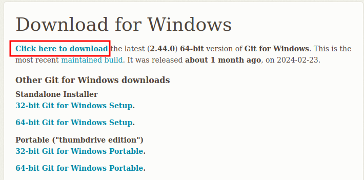

git安装包保存在github上，如果你连不上，需要`科学上网`，或者使用保存在中国服务器上的镜像，例如华为保存的`git for windows`[https://mirrors.huaweicloud.com/git-for-windows/](https://mirrors.huaweicloud.com/git-for-windows/)

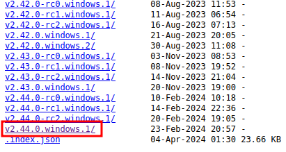

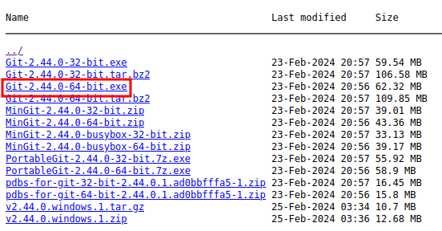

*版本号可能不一样，建议用最新的*

*如果你不知道你在用什么操作系统，那么你在使用Windows操作系统*

*如果你不知道你的电脑是64位还是32位，那么你的电脑是64位的*

双击安装包进行安装，除了需要修改安装位置之外其他均保持默认

## 配置vscode git可视化插件

首先你应该会使用vscode，例如安装简体中文拓展、编程语言拓展等

如果不会，请看vscode基本操作的教程

点击拓展、搜索`Git Graph`拓展，选择并安装

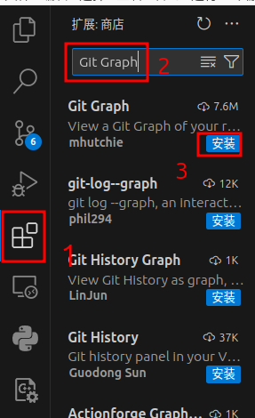

## 注册github账号

为了使用github，你可能需要`科学上网`

进入Github(网址: [https://github.com/](https://github.com/))，注册一个账号(Sign up)或者登录一个已有的Github账号(Sign in)

如果你是第一次注册github用户，强烈建议起一个简短有意义的英文用户名

记住你的Github用户名和注册用的邮箱

## 配置git用户

打开git命令行，输入以下两行命令

```bash
git config --global user.name "改成你的Github用户名"
git config --global user. email "改成你的注册邮箱"
```

例如
```bash
git config --global user.name "YourUserName"
git config --global user. email "114514@qq.com"
```

## 个人项目本地git版本管理案例

创建一个文件夹，在此文件夹中保存你的代码

例如：创建一个名为`test`的文件夹，在其下存放`hello.txt`文件

文件夹结构如下


```
test
└── hello.txt
```

在`hello.txt`中写入`Hello World!`并保存

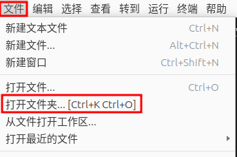

打开vscode，点击左上角的`文件`，选择`打开文件夹`，选择刚才新建的`test`文件夹

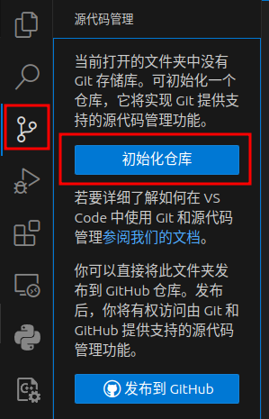

在左侧面板中点击`源代码管理`，点击`初始化仓库`，这时会显示文件的更改情况

`hello.txt`的文件名变为绿色，说明该文件是新建的，黄色表示修改，红色表示删除

选择`更改`右侧加号，即`暂存所有更改`，编辑`消息`一栏的内容，通常是此次提交的简述，例如填写：`第一次提交`

点击提交按钮

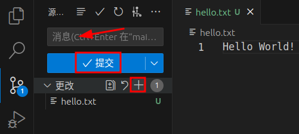

这时git已经保存了这个版本的内容

在`hello.txt`新加一行：`跨越长城，走向世界`，保存文件

查看`源代码管理`，可以看到`更改`一栏有`hello.txt`文件

按加号`暂存所有更改`，编辑`消息`：`添加了中文`，点击提交

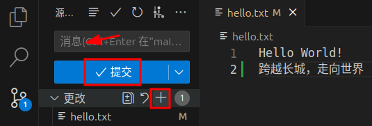

点击分支图标`View Git Graph`，可以看到两次提交的描述、提交时间和作者

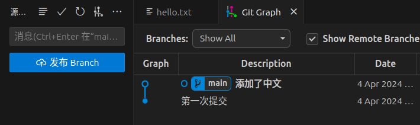

此时，第二个提交有`main`或`master`标签，如果想查看第一个版本，可以右键第一个版本，选择`Checkout(签出)`，这时`hello.txt`就恢复到第一个版本的样子。

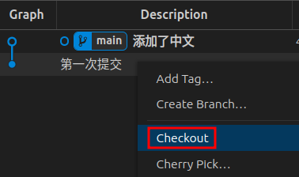

右键第二个版本，选择`Checkout`，文件又回到了第二个版本

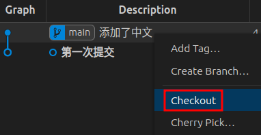

## 使用github存储个人项目

登录后，点击网页右上角的用户头像，下拉栏中点`Your repositories(你的存储库)`，点击绿色的`new`按钮来创建存储库

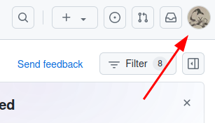

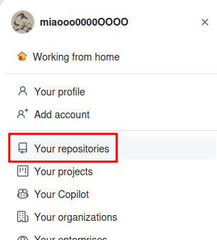

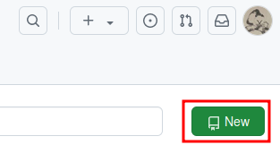

`Repository name(存储库名)`推荐英文大小写+下划线+数字，`Description(描述)`可以简短写下你项目的描述，其他保持默认，点击`Create repository(创建存储库)`

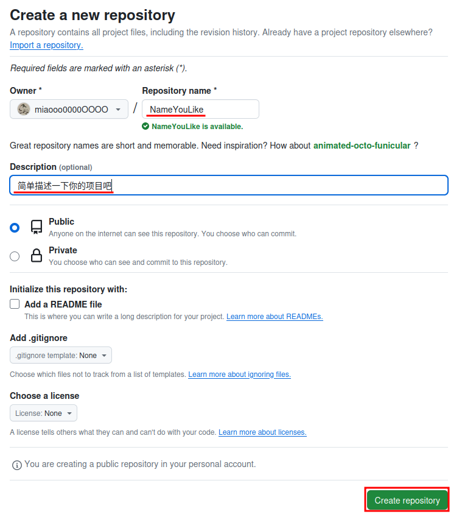

这时，你的存储库是空的，复制存储库的网址(一般是`https://github.com/你的用户名/存储库名`)

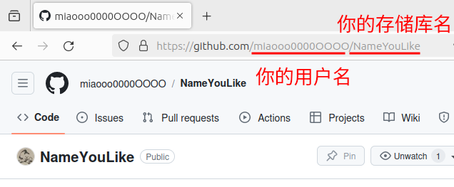

选择一个已建立git储存库的项目，点击`源代码管理`右上角的三个点，依次选择`远程`->`添加远程存储库...`，粘贴你刚才复制的存储库网址，按回车，vscode询问存储库名，输入你的存储库名，这样就将本地存储库与远程存储库进行了绑定

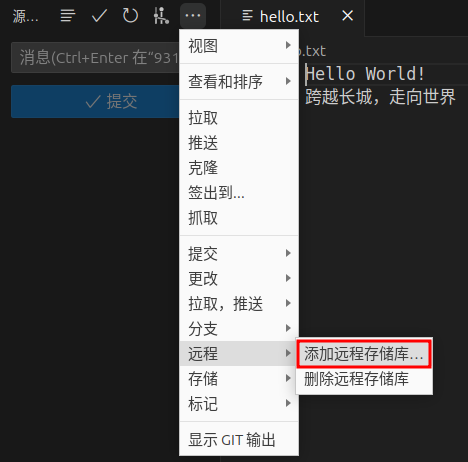

进入`Git Graph`，右键分支标记，点击`Checkout Branch(签出分支)`

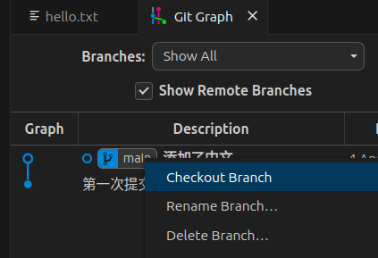

依然点击`源代码管理`右上角的三个点，点击`拉取，推送`->`推送到...`，选择你刚才添加的存储库名，等待上传成功

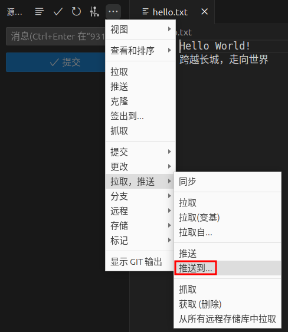

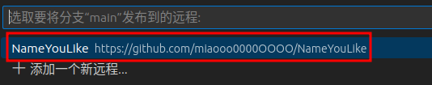

刷新Github存储库页面，看看你的文件是否提交上去了

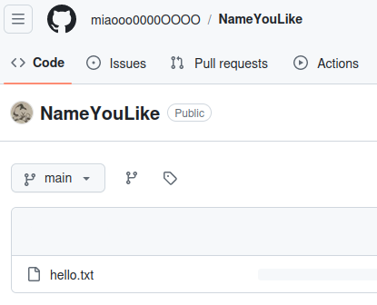

如果你的文件上传成功，那么恭喜你入门了Git与Github使用

## 编写的目的

本教程是一个快速上手的git和github教程，目标读者是初入计算机编程的个人开发者，预想需求是使用git替代压缩软件进行版本管理、使用Github替代百度网盘在云上存储代码

因此本教程应能够快速上手、最小化前置知识

如果你在阅读本教程后遇到了新需求，你的所需的知识点可能是：

- 命令行的使用
- git分支与合并
- 如何选择不同开源许可证
- github issue(提问，报告bug) fork(从他人的存储库分叉) pull requests(为他人的项目提交代码) collaborators(合作开发者)
- 为项目编写README.md、文档、Wiki(百科)

## 进一步阅读材料

*以下教程大多基于命令行讲述，你需要熟悉使用命令行*

Git教程：

一小时掌握Git 教学视频(推荐):[https://www.bilibili.com/video/BV1HM411377j/](https://www.bilibili.com/video/BV1HM411377j/)

Pro Git电子书:[https://git-scm.com/book/zh/v2](https://git-scm.com/book/zh/v2)

Pro Git的PDF文档: [https://github.com/progit/progit2-zh/releases/download/2.1.68/progit.pdf](https://github.com/progit/progit2-zh/releases/download/2.1.68/progit.pdf)

廖雪峰的Git教程: [https://www.liaoxuefeng.com/wiki/896043488029600](https://www.liaoxuefeng.com/wiki/896043488029600)

Github教程：

Github官方教程：[https://docs.github.com/zh/get-started/start-your-journey](https://docs.github.com/zh/get-started/start-your-journey)

Markdown教程：

Markdown + Typora/VSCode 超全教程：[https://www.bilibili.com/video/BV1hG411p7fX/](https://www.bilibili.com/video/BV1hG411p7fX/)

使用Git的图形化教程：[https://learngitbranching.js.org/](https://learngitbranching.js.org/)